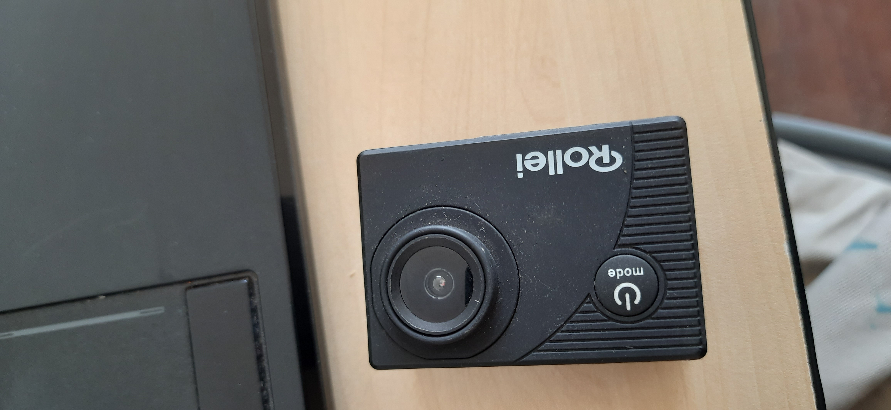
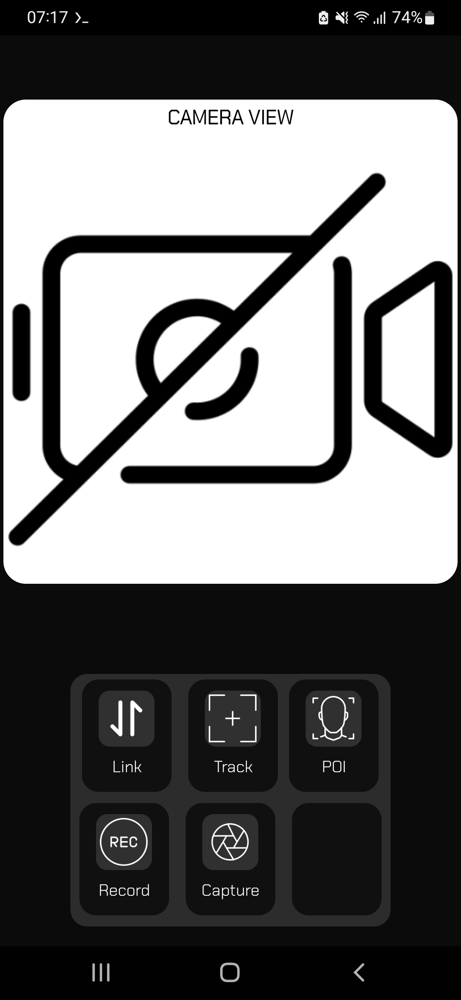
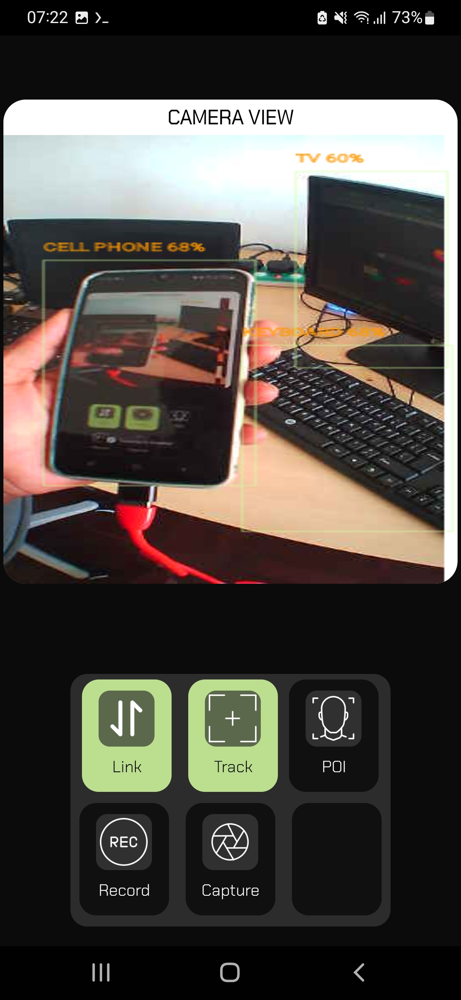

# RView - Remote View App

- RView is an application that enables users to stream a camera feed from a Rollei mini cam using FFMPEG. 
- The app uses FFMPEG to help with streaming and processing the image frames from the camera
- The app is not limited to the Rollei Camera but should work with anything streaming on an HTTP port
- One of the things I learnt was to keep the image frames in flight (in memory) because storing them on disk and them reloading to render is slow and hard on the CPU
- So the idea was to create a stream bridge using FFMPEG, read a stream and restream via UDP, capture each frame and trigger a UI event to render each frame and this worked fine
- Using the Track Mode (the feature of the app that will run an ML model on device to ID objects) works fine but slows down things (ML is CPU intensive) but works fine on capable devices
 
# RView Demo

- Rollei Camera

- RView Home UI

- Rview App Running

### `startFFMPEGStreamBridgeServer`

RView establishes a bridge between the camera and the network using FFMPEG. The `startFFMPEGStreamBridgeServer` function initializes FFMPEG to capture an HTTP stream from the camera (at URL `http://192.168.25.1:8080/?action=stream`) and restream it via a UDP endpoint on port 5151. This enables remote access to the camera feed and starts the streaming process.

### Frame Reception Thread (`streamBridgeServerThread`)

RView utilizes a dedicated thread, `streamBridgeServerThread`, to receive frame data from the UDP outstream generated by the FFMPEG Stream Bridge. The thread continuously listens for incoming data packets and assembles them into frames. When a complete frame is received, it triggers the main UI to display the camera feed. This thread ensures the seamless reception and rendering of frames.

### Object Detection (`runObjectDetection`)

RView incorporates object detection using TensorFlow Lite. The `runObjectDetection` function processes the camera feed in real-time by applying a pre-trained TensorFlow Lite model. Detected objects are drawn on the frames with bounding boxes and labels. Users can enable or disable object tracking and point of interest (POI) tracking through the app's interface. When tracking is enabled, the app identifies and tracks objects within the camera feed.

### `processImageFramesToVideoFile`

The `processImageFramesToVideoFile` function is responsible for processing image frames and creating a video file. Users can choose to record the camera feed, and this function assembles individual frames into a video file for later playback or sharing. The video frames are encoded and saved as a video file.

## App Interface

The app's user interface features various buttons and controls, such as:
- **Connect Camera Button**: Initiates the camera stream and activates the bridge to begin streaming.
- **Track Objects Button**: Enables or disables object tracking.
- **POI Tracking Button**: Enables or disables point of interest (POI) tracking.
- **Record Button**: Starts or stops recording of the camera feed, saving it as a video file.
- **Capture Button**: Captures a snapshot of the camera feed.
- **Video Processing Button**: Appears during video processing and indicates that the app is encoding video frames.

## Other Features

### `activateAllControls`

The `activateAllControls` function is responsible for enabling all the user interface controls when the camera streaming is initiated. It sets the UI elements to their active state, allowing users to interact with the app. It changes the appearance of buttons and buttons' texts to indicate that the camera streaming is in progress. This function ensures a smooth transition when the camera feed is started.

### `saveImageCapture`

The `saveImageCapture` function is triggered when the user presses the capture button to take a snapshot of the camera feed. It saves the captured image as a JPEG file in the snapshots directory. The function generates a unique filename based on the date and time of the capture, ensuring that each snapshot is distinct.

### `initStorageAccess`

The `initStorageAccess` function is responsible for handling storage access permissions. It checks if the app has the necessary permissions to read and write to external storage. If these permissions are not granted, it requests them from the user. Proper storage access is crucial for saving captured images, video frames, and recorded videos.

### `initObjectDetectionModel`

The `initObjectDetectionModel` function initializes the object detection model using TensorFlow Lite. It configures the object detector with specific options, such as setting the maximum number of results and the minimum confidence threshold. The object detection model is loaded from a TensorFlow Lite model file (typically named "model.tflite") in the app's resources. This function ensures that the app is ready to perform object detection on the camera feed.

### `initStreamBridgeEndpoint`

The `initStreamBridgeEndpoint` function sets up the network communication for the streaming bridge. It creates a DatagramSocket that listens on port 5151 for incoming UDP packets. This is where the app receives the camera feed data from the FFMPEG Stream Bridge. If there are any issues with network initialization, the function displays an error message and exits the app.

### `initSystemObjects`

The `initSystemObjects` function initializes various system objects used in the app. It sets up a rotation matrix for image rotation, defines the paint styles for drawing bounding boxes and labels on detected objects, and ensures that the system is ready for image processing and rendering.

### `setVideoProcessingButtonState`

The `setVideoProcessingButtonState` function controls the appearance of the video processing button in the app's UI. It changes the button's color and visibility based on whether video frames are currently being processed. When video processing is active (e.g., when assembling video frames into a video file), the button is displayed in an active state. When processing is complete, the button returns to its default appearance.

### `deactivateAllControls`

The `deactivateAllControls` function is responsible for disabling all user interface controls when the camera streaming is stopped or when certain errors occur. It sets the UI elements to their inactive state, preventing further user interaction. It also cancels any active FFMPEG execution to ensure a clean shutdown.

